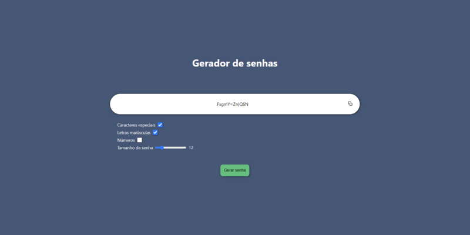
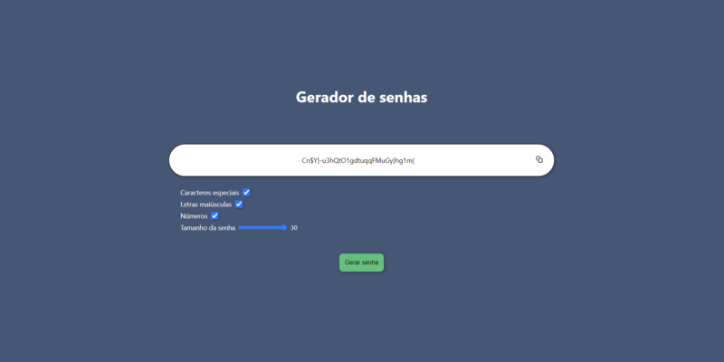

# Gerador de senhas

### Um site que permite ao usuário escolher o tamanho da sua senha, se deseja caracteres especiais, números e letras maiúsculas para, assim, gerar uma senha aleatória.

### O frontend foi feito utilizando React e a aleatoriedade de geração da senha utilizando a função Math.random do Javascript.

 

 
